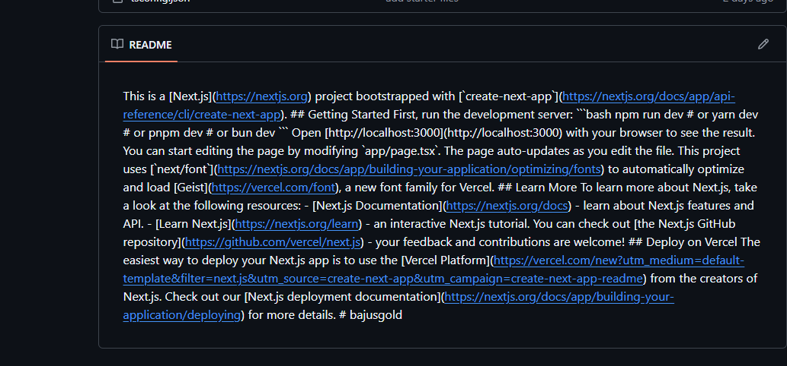

# 🚀 Crowdfunding dApp

A modern **decentralized crowdfunding platform** built with **Next.js, React, Tailwind CSS v4, Zustand, and Ethers.js**, deployed on the **Sepolia Ethereum testnet**.

Create and back crowdfunding campaigns directly from your wallet. All transactions are transparent and verifiable on Etherscan.

---

## 🎨 Project Preview



*Dashboard showing active campaigns with progress bars and funding statistics*

---

## ✨ Features

### Core Functionality
- **Launch Campaigns** - Create new crowdfunding campaigns with goals and deadlines
- **Fund Campaigns** - Contribute ETH to campaigns you believe in
- **Claim Funds** - Campaign creators can withdraw funds when goal is reached
- **Request Refunds** - Contributors get refunds if campaign fails to meet goal

### Platform Features
- 🔐 **MetaMask Integration** - Secure wallet connection
- 📊 **Real-time Analytics** - Track funding trends with charts
- 📋 **Funding Activity** - View all campaign transactions on Etherscan
- ⚡ **Fast UI** - Next.js with Turbopack for lightning performance
- 🌙 **Dark Theme** - Modern amber/orange color scheme
- 📱 **Responsive** - Works on desktop and mobile

---

## 🛠 Tech Stack

| Technology | Purpose |
|------------|---------|
| **Next.js 16** | React framework with App Router |
| **React 19** | UI library |
| **TypeScript** | Type-safe development |
| **Tailwind CSS v4** | Utility-first styling |
| **Zustand** | Lightweight state management |
| **Ethers.js v6** | Ethereum blockchain interaction |
| **Recharts** | Analytics charts |
| **react-hot-toast** | Transaction notifications |
| **MetaMask** | Ethereum wallet |

---

## 📁 Project Structure

```
frontend/
├── public/
│   └── favicon.svg              # Project favicon
├── src/
│   ├── app/
│   │   ├── analytics/
│   │   │   └── page.tsx        # Analytics dashboard
│   │   ├── transactions/
│   │   │   └── page.tsx        # Funding activity history
│   │   ├── globals.css          # Global styles & theme
│   │   ├── layout.tsx          # Root layout with providers
│   │   └── page.tsx             # Dashboard (home)
│   ├── components/
│   │   ├── analytics/
│   │   │   ├── AreaChart.tsx    # Funding trend chart
│   │   │   ├── BarChart.tsx     # Campaign goals chart
│   │   │   ├── Charts.tsx       # Chart container
│   │   │   ├── LineChart.tsx    # Contributions over time
│   │   │   └── StatsCard.tsx    # Statistic cards
│   │   ├── campaign/
│   │   │   ├── CampaignCard.tsx     # Individual campaign card
│   │   │   ├── CampaignGrid.tsx     # Campaign grid layout
│   │   │   └── LaunchCampaignModal.tsx  # Create campaign form
│   │   ├── layout/
│   │   │   ├── DashboardCard.tsx   # Card wrapper component
│   │   │   ├── Footer.tsx           # Site footer
│   │   │   ├── Navbar.tsx           # Navigation bar
│   │   │   └── Web3Layout.tsx       # Layout wrapper
│   │   ├── transactions/
│   │   │   ├── FilterBar.tsx        # Transaction filters
│   │   │   ├── Pagination.tsx       # Pagination controls
│   │   │   └── TransactionTable.tsx  # Transaction display table
│   │   ├── ui/
│   │   │   ├── Button.tsx            # Styled button component
│   │   │   ├── Card.tsx              # Card component
│   │   │   └── Input.tsx             # Form input component
│   │   └── wallet/
│   │       ├── ConnectButton.tsx     # Wallet connection
│   │       ├── MetaMaskBanner.tsx    # MetaMask install prompt
│   │       ├── WalletButton.tsx      # Connect/disconnect
│   │       └── WalletStatus.tsx      # Connection status
│   ├── constants/
│   │   └── config.ts             # Contract & network config
│   ├── hooks/
│   │   ├── useAnalytics.ts       # Analytics data hook
│   │   ├── useContract.ts        # Contract interaction hook
│   │   ├── useCrowdfunding.ts    # Campaign operations hook
│   │   ├── useMounted.ts         # Client-side mount detection
│   │   ├── useTransactions.ts    # Transaction history hook
│   │   └── useWallet.ts          # Wallet connection hook
│   ├── lib/
│   │   ├── analytics.ts          # Analytics utilities
│   │   ├── contract.ts           # Smart contract ABI & functions
│   │   ├── errorHandler.ts       # Error handling utilities
│   │   ├── ethers.ts             # Ethers.js configuration
│   │   ├── toast.ts              # Toast notification helpers
│   │   └── transactions.ts       # Transaction utilities
│   ├── store/
│   │   ├── analyticsStore.ts     # Analytics state
│   │   ├── transactionStore.ts   # Transaction state
│   │   └── useWalletStore.ts     # Wallet state
│   ├── types/
│   │   ├── analytics.ts          # Analytics type definitions
│   │   ├── index.ts              # Central type exports
│   │   └── transaction.ts        # Transaction type definitions
│   └── constants/
│       └── config.ts             # Configuration constants
├── .env.local                    # Environment variables
├── package.json                  # Dependencies
└── tsconfig.json                 # TypeScript config
```

---

## 🔗 Smart Contract

The dApp interacts with the **Crowdfunding** smart contract deployed at:

```
0xDFC67a4976C3719CD2F6531808F40953406f8205
```

### Contract Functions

| Function | Description |
|----------|-------------|
| `createCampaign()` | Create a new campaign with title, description, goal, min contribution, and duration |
| `contribute()` | Contribute ETH to a campaign (payable) |
| `claimFunds()` | Creator claims funds when goal is reached and campaign ends |
| `refund()` | Contributors request refund if campaign failed |
| `getCampaign()` | Get campaign details by ID |
| `campaignCount()` | Get total number of campaigns |

### Contract Events

| Event | Description |
|-------|-------------|
| `CampaignCreated` | Emitted when a new campaign is created |
| `ContributionReceived` | Emitted when someone contributes |
| `FundsClaimed` | Emitted when creator claims funds |
| `RefundIssued` | Emitted when refund is processed |

---

## 🌐 Network Configuration

| Network | Chain ID | RPC URL |
|---------|----------|---------|
| Sepolia Testnet | `0xaa36a7` | `https://rpc.sepolia.org` |

---

## 📦 Installation & Setup

```bash
# Install dependencies
npm install

# Run development server
npm run dev

# Build for production
npm run build

# Start production server
npm run start
```

### Environment Variables

Create `.env.local` in the frontend directory:

```env
NEXT_PUBLIC_CONTRACT_ADDRESS=0xDFC67a4976C3719CD2F6531808F40953406f8205
NEXT_PUBLIC_CHAIN_ID=0xaa36a7
```

---

## 📄 Pages Overview

### Dashboard (`/`)
- Project overview stats (Total Raised, Active Campaigns)
- Campaign grid with progress bars
- Launch Campaign modal

### Analytics (`/analytics`)
- Funding statistics cards
- Contributions over time charts
- Global funding trends

### Funding Activity (`/transactions`)
- Transaction history table
- Filter by type (Created, Contribution, Claimed, Refund)
- Search by address or tx hash
- Etherscan links

---

## 🎨 Color Theme

| Element | Color |
|---------|-------|
| Primary | Amber `#f59e0b` |
| Secondary | Cyan `#06b6d4` |
| Background | Dark `#0f0f1a` |
| Card BG | Zinc `#16162a` |
| Text Primary | Zinc `#f4f4f5` |
| Text Muted | Zinc `#71717a` |

---

## 🔒 Security Notes

- All transactions require MetaMask connection
- Contract address is verified on Sepolia testnet
- Never share your private keys
- Use testnet for development only

---

## 📜 License

MIT License - Built for educational purposes on Ethereum Sepolia testnet.

---

**Built with ❤️ using Next.js, Ethers.js, and Solidity**